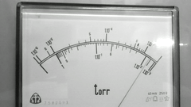
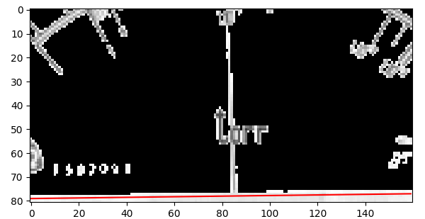
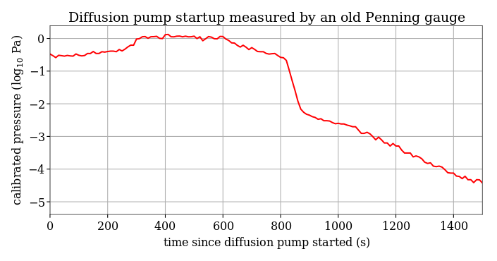

## gauge2data - record a movie of an analog gauge, get the time-resolved plot

This script can be useful for everybody who uses or repairs old analog instruments of any kind. By means of the [Hough transform](https://en.wikipedia.org/wiki/Hough_transform), it find the angle of the longest line in each video frame. Therefore, if you place a camera or a mobile phone in front of an old instrument and record a video, you can later get the temporal evolution of any quantity displayed by an analog gauge, without tapping any wire in the instrument and without exporting data from a digital oscilloscope. It may be useful to switch to the timelapse function of the camera/phone, but in this case you want to remember what is its frames-per-second rate for later scaling of the x-axis.

#### Input
An example: Assume you have recorded the 1280x720 video that follows, with timelapse setting of 0.1 FPS. (For this README, a thumbnail was created with smaller size and converted to gif.)
<!---  commands to generate it: 
ffmpeg -i test.3gp -filter:v scale=240:-1 -vf "fps=15,scale=320:-1:flags=lanczos,palettegen" -y  palette.png
ffmpeg -v warning -i test.3gp -i palette.png -lavfi "fps=15,scale=320:-1:flags=lanczos [x]; [x][1:v] paletteuse" -y out.gif
 -->


When loaded, the frames are downsized due to the memory imprint and also the computation time of the Hough transform. Usually the default horizontal resolution  `-resize 320` is fine. (This is a technical limitation: Whole raw video stream, after resizing, is loaded into the memory uncompressed.)

#### Image preprocessing
To get reasonable results, all unwanted long straight lines should be cropped, including the gauge boundaries. To this end, specify the `-topcrop`, `-bottomcrop`, `-leftcrop`, `-rightcrop` parameters as numbers from 0 (no crop) up to 1 (would crop the whole image to the opposite side).

By default, the internal ["Otsu" black/white thresholding algorithm](http://scikit-image.org/docs/dev/auto_examples/plot_otsu.html) should work well, but if needed, you can change the `-adjustthreshold 1.2` parameter, or in special cases you can also try to use simple thresholding by a given value (the `-hardthreshold` option). 

The correct command used here is:

```
./gauge2data.py -input penning_DP_cooled_1s.3gp   -bottom .15 -left .25 -right .25 -top .4
```

Often it takes few seconds to load the video and few tens of seconds to compute all Hough transforms.

#### Optional visual debug

If the computation does not work as expected, enable the option `-visual 1`  for visual inspection of each pre-processed image that is passed to the Hough transform. The detected line is drawn red. For instance, the following image shows the bottom crop is not sufficient and the gauge rim is erroneously detected as the longest line:



Note that the images are also internally inverted to have white lines on a black background.

#### Data calibration
Finally, you will want to calibrate the gauge, i.e. to assign the resolved angles to actual values. By default, _gauge2data_ picks five equidistant angles, shows the corresponding images and asks you for the actual value readout. You can change the number of the calibration points by the option `-calibrate`; set it to zero to output plain, non-calibrated, angles.

If empty or invalid value is entered, the calibration point will not be used.

Note that if you often get angles close to -90, 0 or +90 degrees, the Hough transform detects some linear artifact on the image; you should use the `-visual 1` option and check the cropping region.
#### Result


The result is in two-column ASCII file and can be easily plotted e.g. using the [plotcommander program](https://github.com/FilipDominec/plotcommander).


## Installation and compatibility
The program was tested on Ubuntu 16.10, needing the following dependencies:

```
apt install ffmpeg python3-scipy python3-skimage python3-skimage-lib python3-matplotlib
```

If you can not run it, and need to convert just few files, feel free to contact the author personally. 

## Command-line parameters
```
usage: gauge2data.py [-h] [-input INPUT] [-output OUTPUT] [-topcrop TOPCROP]
                     [-bottomcrop BOTTOMCROP] [-leftcrop LEFTCROP]
                     [-rightcrop RIGHTCROP] [-fps FPS] [-decim DECIM]
                     [-skipframes SKIPFRAMES] [-BPP BPP]
                     [-adjustthreshold ADJUSTTHRESHOLD]
                     [-hardthreshold HARDTHRESHOLD] [-visual VISUAL]
                     [-calibrate CALIBRATE]

Convert a (timelapse) video of an analog gauge to a data series

optional arguments:
  -h, --help            show this help message and exit
  -input INPUT          input file name (may be any format accepted by ffmpeg)
  -output OUTPUT        output file name (stdout if left empty)
  -topcrop TOPCROP      crop from top (from 0 to 1)
  -bottomcrop BOTTOMCROP
                        crop from bottom (from 0 to 1)
  -leftcrop LEFTCROP    crop from left (from 0 to 1)
  -rightcrop RIGHTCROP  crop from right (from 0 to 1)
  -fps FPS              frames per second; use 24 for real-time video, and
                        e.g. 0.1 for timelapse with 10 second period
  -decim DECIM          decimate images for faster processing, set to 0
  -skipframes SKIPFRAMES
                        process every n-th frame only
  -BPP BPP              bytes per pixel
  -adjustthreshold ADJUSTTHRESHOLD
                        adjusting the Otsu threshold of white background
                        (Hough transform works the best with flat background)
  -hardthreshold HARDTHRESHOLD
                        if set positive, defines a hard brightness value of
                        thresholding
  -visual VISUAL        shows the line-detection results on each processed
                        frame
  -calibrate CALIBRATE  if nonzero, enables interactive calibration on the
                        selected values; otherwise angles are output
```


